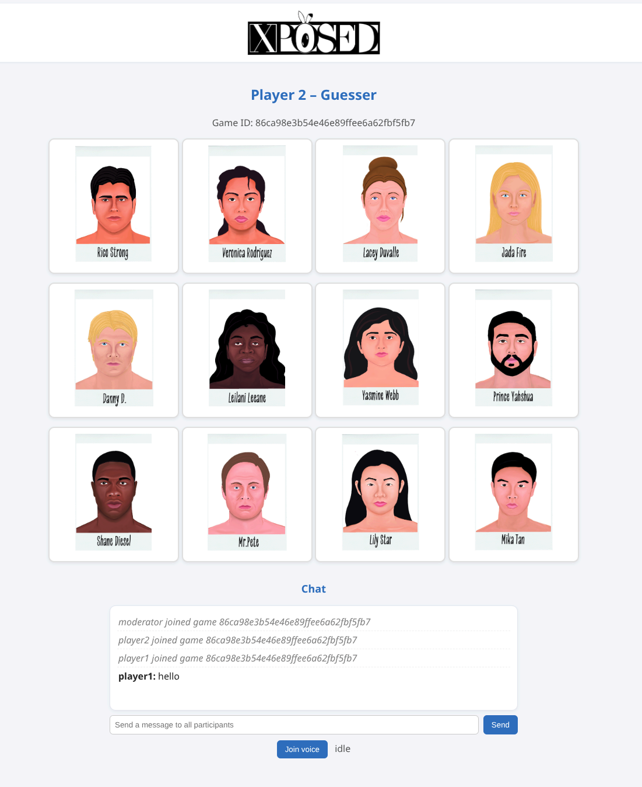
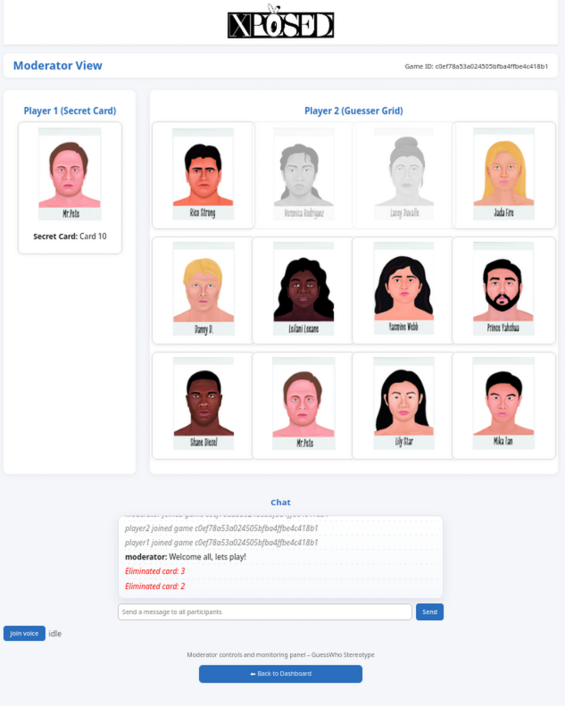

"XPOSED" is an interactive web application inspired by the classic “Guess Who?” game, designed to explore how people express stereotypes. Instead of discussing stereotypes explicitly, players reveal their reasoning through the process of asking yes/no questions and eliminating characters — while a moderator observes and asks clarifying questions.


---

## ✨ Features 

- 🧑‍🎓 **Player 1** – sees one *secret* card and answers yes/no questions  
- 🧑‍🚀 **Player 2** – sees all character cards, asks questions, and eliminates options based on the answers
- 🧑‍⚖️ **Moderator** – monitors both players in real time, manages game sessions (start/end/reset)
- 💬 **Real-time communication** powered by Socket.IO (synchronized questions, answers, and card eliminations)
- 🗃️ **SQLite logging** of all events (chat, eliminations, system messages)

---

## 🛠️ Tech Stack

| Layer              | Technology                            |
| ------------------ | ------------------------------------- |
| **Frontend**       | HTML + JavaScript (Socket.IO)         |
| **Backend**        | Flask (Python 3.13) + Flask-SocketIO |
| **Database**       | SQLite 3            |
| **Deployment**     | Local (MVP) → AKS later       |
| **Audio** | WebRTC              |

---

## 🚀 How to Run / Test

### 1. Set up environment
```bash

python -m venv venv
source venv/bin/activate  
pip install -r requirements.txt
```

### 2. Start the server
```bash
python app.py
```
### 3. Open the main index page  

```
http://127.0.0.1:5000/
```
**Moderator logs in** using the password and accesses the dashboard.

**Moderator workflow:**
- Click **"Open Entry"** to allow participants to join
- Participants join via the waiting page: `http://127.0.0.1:5000/join`
- Once 2 participants have joined, click **"Start Game"**
- Monitor the game session in real-time
- Click **"End Game"** when finished
- Click **"Reset Session"** to prepare for the next pair of participants

---


