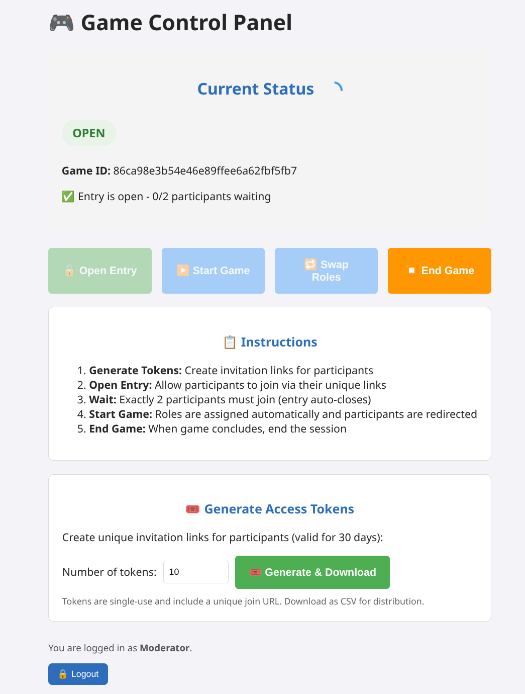
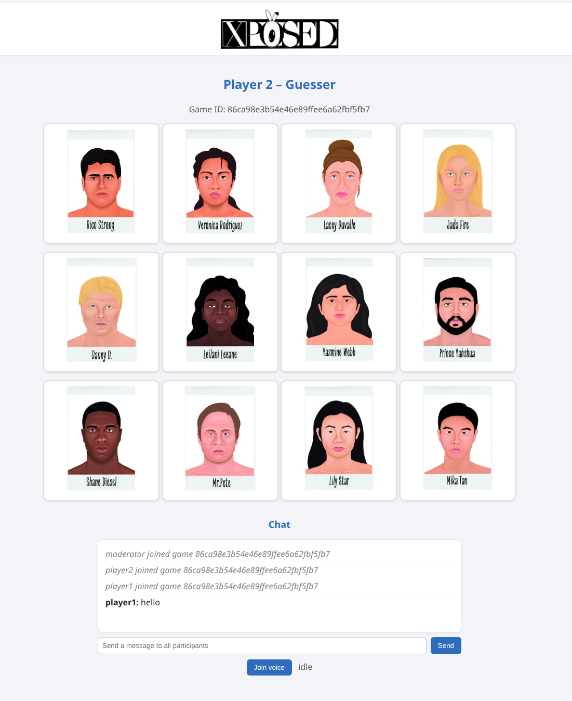
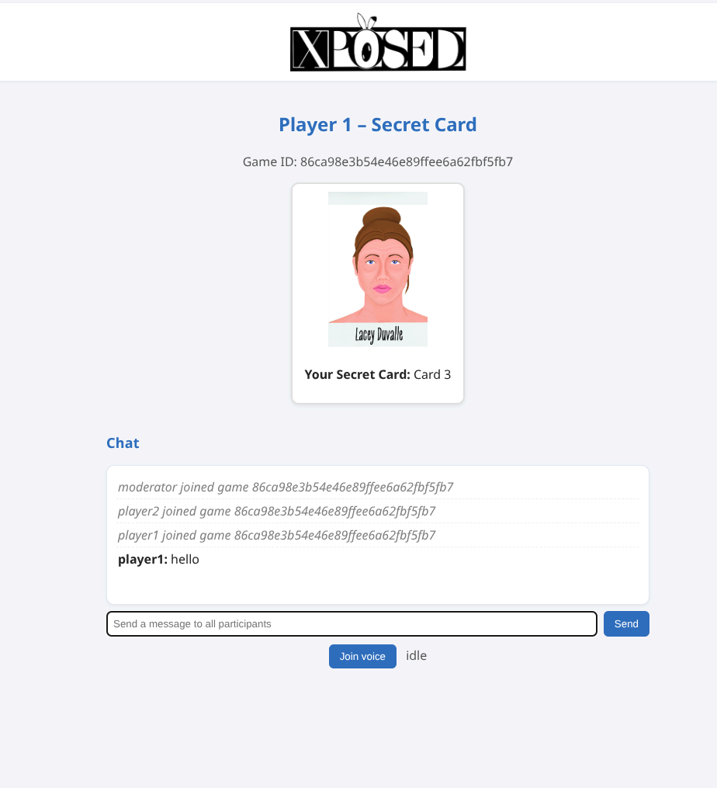

[](https://github.com/ptypes-nlesc/guesswho-stereotype/actions/workflows/pytest.yml)

## 📖 Overview

This web application is a deduction-style board game designed to explore how people express stereotypes through reasoning and decision-making. 

**How it works:** Two players face off:
- **Player 1 (Secret Holder):** Draws a secret target character and answers Player 2's questions
- **Player 2 (Guesser):** Sees a grid of 12 characters and asks feature-based questions to deduce the secret character. With each answer, Player 2 eliminates non-matching characters from the board.

When the game ends (i.e., one card remains), the roles swap for the next round. Players communicate via real-time text chat and voice, with all interactions automatically recorded and stored in a database for research analysis. A moderator observes the session and can ask clarifying questions to understand the players' reasoning patterns.

---

## 🛠️ Tech Stack

| Layer              | Technology                            |
| ------------------ | ------------------------------------- |
| **Frontend**       | HTML + JavaScript (Socket.IO)         |
| **Backend**        | Flask (Python 3.13) + Flask-SocketIO |
| **Database**       | MySQL / MariaDB      |
| **Cache/Session**  | Redis                |
| **Deployment**     | Local (MVP) → AKS later       |
| **Audio** | WebRTC              |

---

## 🚀 How to Run / Test

### 1. Set up environment
```bash

python -m venv venv
source venv/bin/activate  
pip install -r requirements.txt
```

### 2. Configure MySQL/MariaDB
Create a `.env` file with the required settings.

To connect with the CLI using the current configuration:

```bash
mysql -h localhost -P 3306 -u xposed_user -p xposed_db
```

### 3. Start the server
```bash
python app.py
```
### 4. Open the main index page  

```
http://127.0.0.1:5000/
```
**Moderator logs in** using the password and accesses the dashboard.

**Moderator workflow:**
- Click **"Open Entry"** to allow participants to join
- Participants join via the waiting page: `http://127.0.0.1:5000/join`
- Once 2 participants have joined, click **"Start Game"**
- Monitor the game session in real-time
- Click **"Swap Roles"** when first round is completed to swap the roles
- Click **"End Game"** when finished

---



