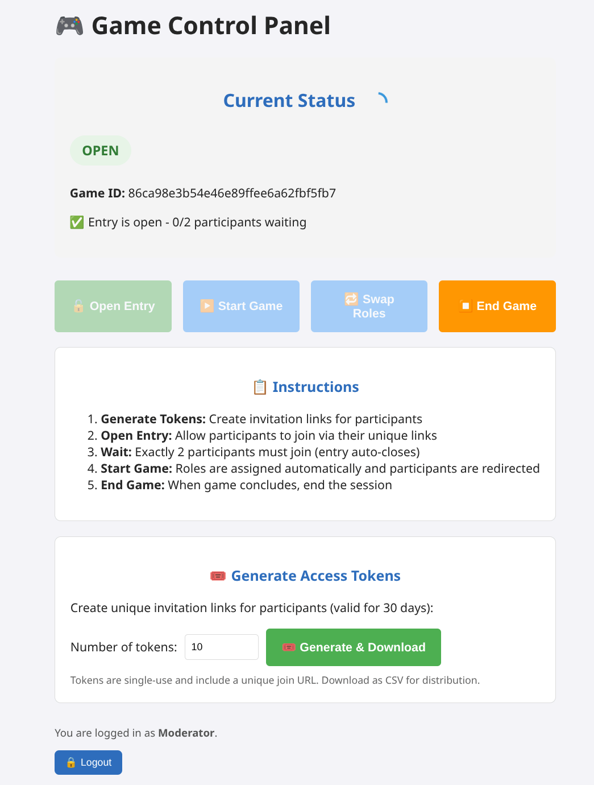
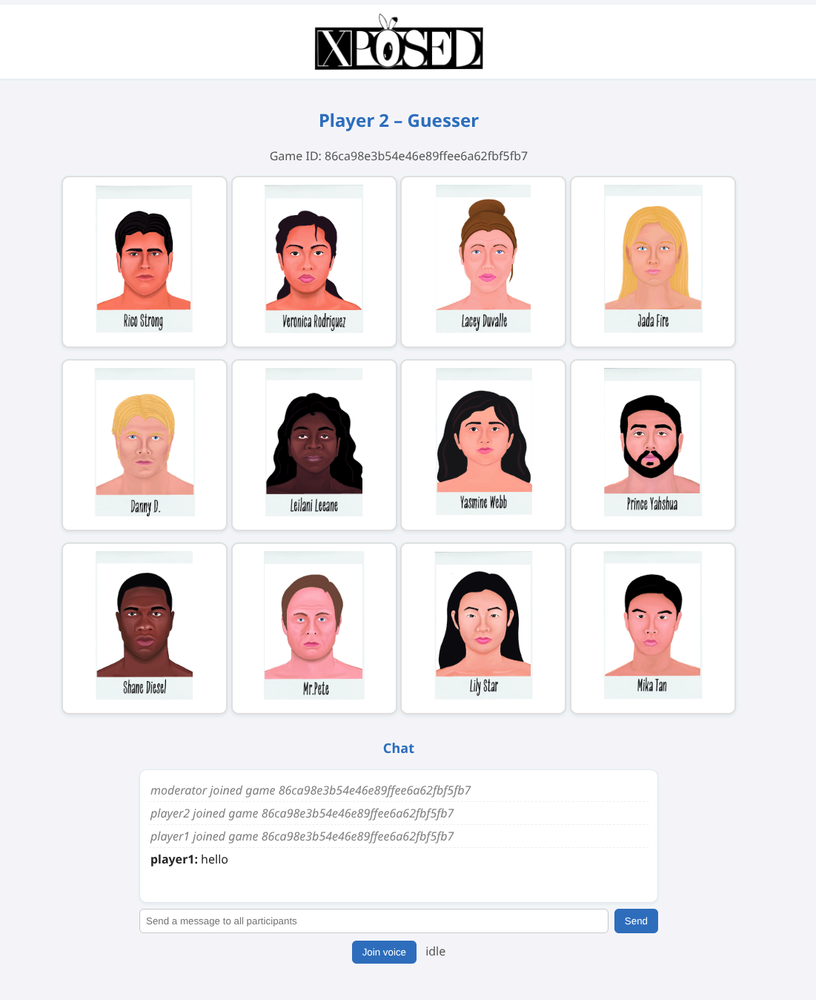
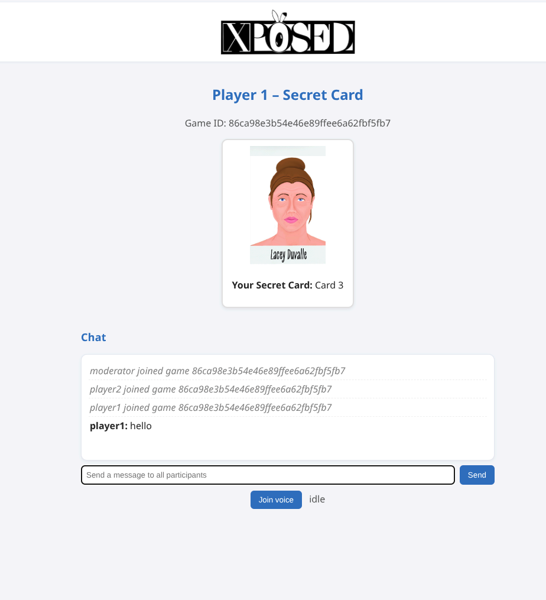

[](https://github.com/ptypes-nlesc/guesswho-stereotype/actions/workflows/pytest.yml)

# Xposed

Research web app for studying how people express stereotypes in a two-player deduction game. A moderator runs the session; participants join with one-time tokens. Chat, voice, and game events are stored for analysis.

## How it works

- **Player 1** sees a secret character and answers questions.
- **Player 2** sees a 12-card grid, asks questions, and eliminates cards.
- After round 1, **roles swap**. A **moderator** observes, chats, and controls recording.
- Optional **auditor** role: read-only staff access.

## Stack

| Layer | Technology |
|------|-------------|
| Frontend | HTML, JavaScript (Socket.IO, WebRTC) |
| Backend | Flask 3, Flask-SocketIO |
| Data | MariaDB; Redis for live state |
| Voice | WebRTC mesh; coturn TURN or public ICE fallback |
| Runtime | Gunicorn + gevent WebSocket worker |

## Local run

Requires Python 3.13+, MariaDB or MySQL, and Redis.

```bash
python -m venv venv
source venv/bin/activate
pip install -r requirements.txt
```

`.env` in the project root (minimum):

```env
SECRET_KEY=change-me
MODERATOR_PASSWORD=change-me
# DB_HOST, DB_USER, DB_PWD, DB_NAME — or DATABASE_URL
# REDIS_HOST=localhost
# AUDIO_STORAGE_DIR=  # filesystem path; default data/audio
# TURN_SERVER / TURN_SECRET  # omit for public ICE fallback
```

```bash
gunicorn --worker-class geventwebsocket.gunicorn.workers.GeventWebSocketWorker \
  -w 1 --bind 127.0.0.1:5000 --log-level info wsgi:app
```

Open http://127.0.0.1:5000/ → staff login → dashboard → open entry / tokens → participants join → start game.

## Documentation

MkDocs site in [`docs/`](docs/): [user guide](docs/USAGE_GUIDE.md), [API](docs/api.md), [deploy](docs/deploy.md), [roadmap](docs/ROADMAP.md).

## License

Apache 2.0 — see [LICENSE](LICENSE).

---

<p>
  
  
  
</p>
